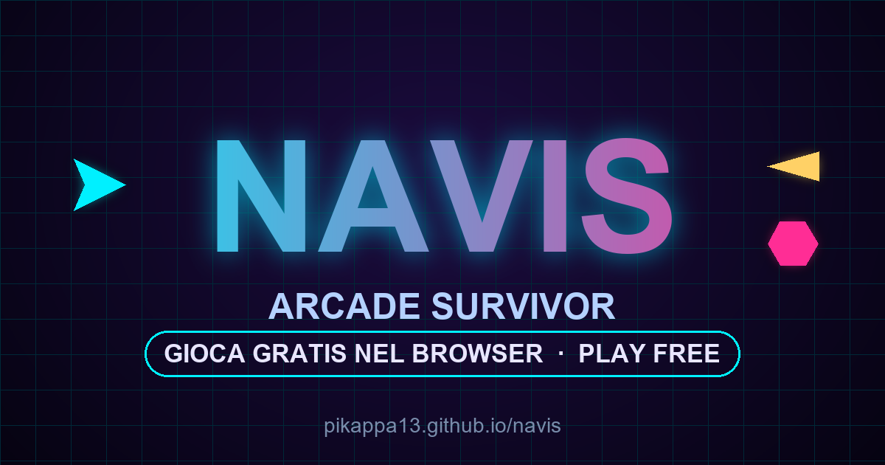

<div align="center">

# 🚀 Navis — Arcade Survivor

[](https://pikappa13.github.io/navis/)
[](LICENSE)


**Un gioco arcade 2D twin-stick in stile neon/synthwave, in un singolo file HTML, senza dipendenze né build.**

### ▶ [**Gioca ora nel browser →**](https://pikappa13.github.io/navis/)



</div>

---

*Navis* (latino per "nave") è uno **shooter twin-stick a ondate**: pilota la tua navicella, schiva
sciami di nemici, spara senza sosta, raccogli potenziamenti, scegli upgrade a ogni ondata e
sopravvivi il più a lungo possibile affrontando boss sempre più ostici. Tutto gira **direttamente
nel browser** — niente download, niente installazione, niente plugin.

## 📑 Indice
- [Gioca ora](#-gioca)
- [Caratteristiche](#-caratteristiche)
- [Come si gioca](#-come-si-gioca)
- [Meccaniche di gioco](#-meccaniche-di-gioco)
- [Eseguire in locale](#-eseguire-in-locale)
- [Struttura del progetto](#-struttura-del-progetto)
- [Tecnologia](#-tecnologia)
- [Contribuire](#-contribuire)
- [Licenza](#-licenza)
- [Autore](#-autore)

## 🎯 Gioca
👉 **[pikappa13.github.io/navis](https://pikappa13.github.io/navis/)**

Funziona su desktop e mobile. Per giocare offline basta scaricare `index.html` e aprirlo nel browser.

## ✨ Caratteristiche
- 🎮 **Twin-stick a ondate** con fuoco automatico e mira continua
- 👾 **4 tipi di nemici** dal comportamento diverso (inseguitori, serpeggianti, schizzati, corazzati)
- 💀 **Boss ogni 5 ondate** con 3 pattern di fuoco e una fase di *enrage* sotto al 40% di vita
- 🃏 **Progressione roguelite**: a ogni ondata scegli **1 potenziamento tra 3 carte**
- 💊 **Power-up** raccoglibili: gettoni, cura, raffica rapida, multi-colpo
- ⚡ **Scatto/schivata** con frame d'invulnerabilità e cooldown
- 🔥 **Sistema combo** con moltiplicatore di punteggio
- 🎆 **Tanta "juice"**: particelle, screen-shake, glow al neon, slow-motion
- 🎵 **Musica synthwave ed effetti generati in tempo reale** via Web Audio API (nessun file audio)
- 🏆 **Record salvato** localmente (`localStorage`)
- 📱 **Controlli touch** completi per il mobile
- 🪶 **Singolo file, zero dipendenze**: ~800 righe di HTML/CSS/JS vanilla

## 🕹 Come si gioca
Sopravvivi alle ondate, potenziati e sconfiggi i boss. Più combo fai, più punti guadagni.

### Desktop
| Comando | Azione |
|---|---|
| `W` `A` `S` `D` / frecce | Muovi la nave |
| Mouse | Mira (il fuoco è **automatico**) |
| `Spazio` / `Shift` | Scatto / schivata |
| `P` / `Esc` | Pausa |

### Mobile
| Comando | Azione |
|---|---|
| Trascina | Muovi la nave (mira automatica sul nemico più vicino) |
| Doppio tocco | Scatto / schivata |

## ⚙️ Meccaniche di gioco

### Nemici
| Tipo | Comportamento |
|---|---|
| **Chaser** | Ti insegue dritto |
| **Zigzag** | Si avvicina serpeggiando, difficile da colpire |
| **Darter** | Veloce e fragile |
| **Tank** | Lento e molto resistente, con barra vita |

### Boss
Compaiono **ogni 5 ondate**, con vita crescente. Alternano tre pattern — raffica **radiale**,
**colpi mirati** e **spirale** — e diventano più aggressivi (*enrage*) quando la vita scende sotto
il 40%. Sconfiggerli dà un grosso bonus di punti e una pioggia di power-up.

### Potenziamenti (a ogni ondata)
Alla fine di ogni ondata scegli **una carta tra tre**:

| Potenziamento | Effetto |
|---|---|
| 🔱 Cannoni gemelli | +1 proiettile per colpo |
| ⚡ Raffica rapida | +18% cadenza di fuoco |
| 💥 Munizioni perforanti | +1 danno per colpo |
| 🛡️ Scafo rinforzato | +1 vita massima (e cura) |
| ❤️ Riparazione | +2 vita |
| 🚀 Propulsori | +12% velocità |
| 💨 Reattore scatto | −20% ricarica scatto |
| 🧲 Calamita | +50% raggio di raccolta |

### Power-up a terra
💲 Gettoni (punti) · ❤️ Cura · » Raffica rapida · ✶ Multi-colpo

## 💻 Eseguire in locale
Nessuna build, nessun pacchetto da installare.

```bash
# 1. Clona il repository
git clone https://github.com/pikappa13/navis.git
cd navis

# 2a. Apri direttamente index.html nel browser
#     — oppure —
# 2b. Servilo con un semplice server statico:
python -m http.server 8000
# poi apri http://localhost:8000
```

## 🗂 Struttura del progetto
```
navis/
├── index.html                       # Il gioco completo: logica, grafica e audio
├── og-image.png                     # Immagine di anteprima social (Open Graph)
├── favicon.svg                      # Icona del sito
├── robots.txt                       # Direttive per i crawler
├── sitemap.xml                      # Sitemap per i motori di ricerca
├── LICENSE                          # Licenza MIT
├── README.md
└── .github/workflows/deploy-pages.yml   # Deploy automatico su GitHub Pages
```

## 🛠 Tecnologia
- **HTML5 Canvas 2D** per il rendering
- **Web Audio API** per musica ed effetti generati a runtime (nessun asset audio)
- **localStorage** per la persistenza del record
- **JavaScript vanilla** — nessun framework, nessuna dipendenza, nessun passaggio di build
- **GitHub Pages** + GitHub Actions per il deploy automatico
- Ottimizzato per i motori di ricerca: meta tag, Open Graph, Twitter Card e dati strutturati JSON-LD (`schema.org/VideoGame`)

## 🤝 Contribuire
Idee, bug report e pull request sono benvenuti!
1. Fai un fork del progetto
2. Crea un branch (`git checkout -b feature/mia-idea`)
3. Fai commit delle modifiche
4. Apri una Pull Request

Trattandosi di un singolo file, basta modificare `index.html` e ricaricare il browser per vedere i cambiamenti.

## 📄 Licenza
Distribuito sotto licenza **[MIT](LICENSE)**. Sei libero di usare, modificare e ridistribuire il
progetto, anche per scopi commerciali, mantenendo la nota di copyright.

## 👤 Autore
**Sviluppato da Patrick Battistini**

- GitHub: [@pikappa13](https://github.com/pikappa13)

Se Navis ti piace, lascia una ⭐ al repository — aiuta il progetto a farsi trovare!
